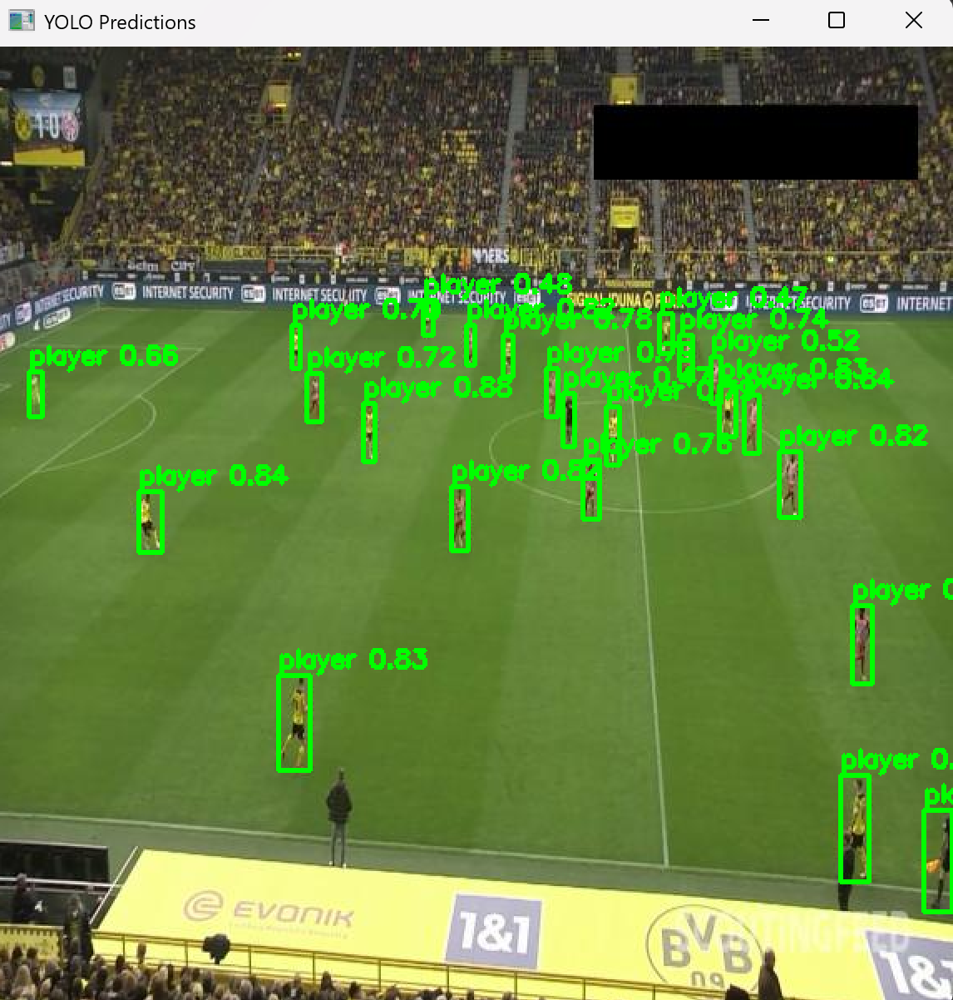

# ⚽ Football Players Detection using YOLO

This project is a mini Computer Vision application that uses **YOLO (Ultralytics)** to detect important objects in football match images.

The model is trained to detect the following classes:
- 🧍 Player
- 🧤 Goalkeeper
- 🧑‍⚖️ Referee
- ⚽ Ball

The dataset is sourced from **Roboflow** and follows the YOLO annotation format.

## 📄 Dataset Configuration

The `data.yaml` file defines the dataset paths and class names:

- Training images path
- Validation images path
- Test images path
- Number of classes
- Class labels

## ⚙️ Steps and Installation

1. Clone this repository.
2. Create a Virtual Environment.
    - ``python -m venv venv`` and activate the environment ``venv\Scripts\activate`` on Windows or ``source venv/bin/activate`` on Mac.
3. **Install the dependences.**
    - ``pip install ultralytics opencv-python matplotlib``
4. Ensure Dataset setup looks clean
    - train folder
    - test folder
    - valid folder
    - data.yaml folder
5. **Train Model** - run ``python train.py``
6. Finally run the output and run the **visualize.py** to view output with images.

---

## 🚀 Training the Model

The model is trained using a opencv python, matplotlib.

## Outputs

Label along with its confidence.

